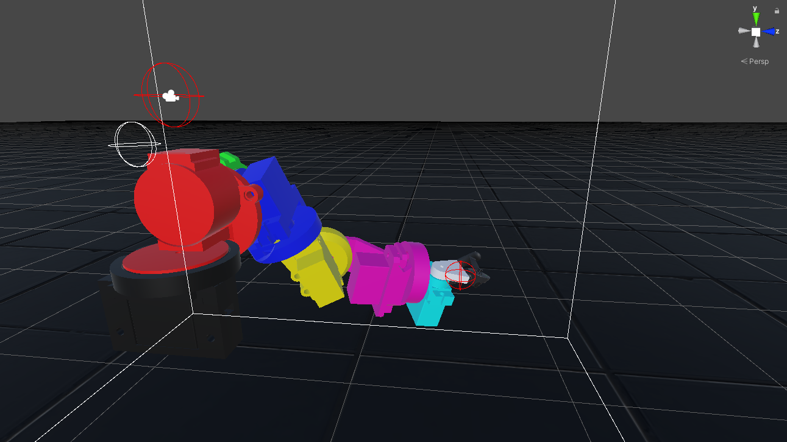
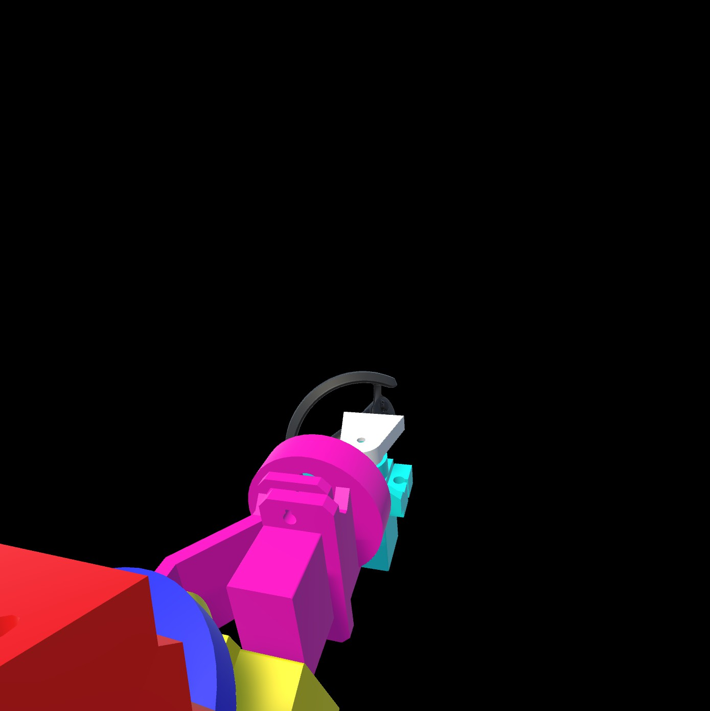
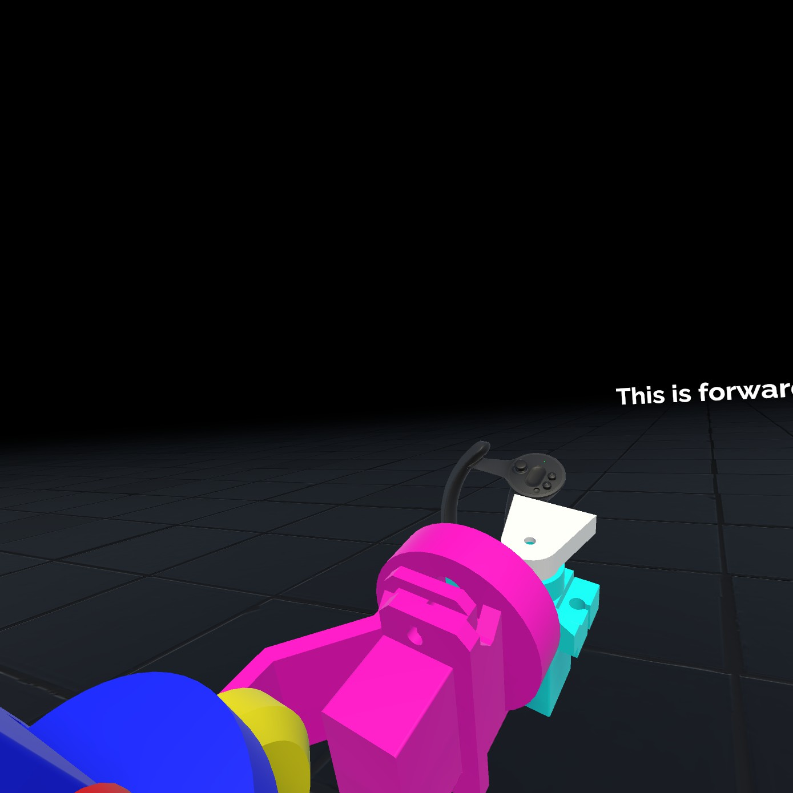

# VR-Robot
## About
A VR controlled robot with head and hand tracking (PC software only, see [VR-Robot-AVR](https://github.com/JaydenGrubb1/VR-Robot-AVR)). This project was done in collaboration with [Tony Li](https://github.com/tli146) who designed and built the mechanical robot hardware. 

This software provides the interface between the user and the robotic arm. It uses the movement of the users head measured by the HMD to adjust the angle of a webcam on the robot (head mechanism not yet built). Additionally the relative position of the users hand, measured by one of the Controllers, is used to set the robot's arm desired end effector position. This, in turn, is used to derive the necessary angle of each of the arm's joints using a gradient descent inverse kinematics model.

## Other Software
Make sure to install the following plugins from Unity asset store and import to their default location
- [SteamVR Plugin](https://assetstore.unity.com/packages/tools/integration/steamvr-plugin-32647)
- [DOTween (HOTween v2)](https://assetstore.unity.com/packages/tools/animation/dotween-hotween-v2-27676)

## Images
  

  

## Video
*coming soon...*

## Compatability
This software should support any OpenVR compatable VR headsets but has only been tested on the [Valve Index](https://store.steampowered.com/valveindex)

## Tasks
- [x] In engine 3D representation of robot arm
- [x] Blank callibration scene (i.e. prior to initializing webcam feed)
- [x] Inverse kinematics model and solver
- [x] World space UI
- [ ] HMD/user callibration
- [ ] Serial bus writer interface

## License
[BSD-3-Clause License](LICENSE)